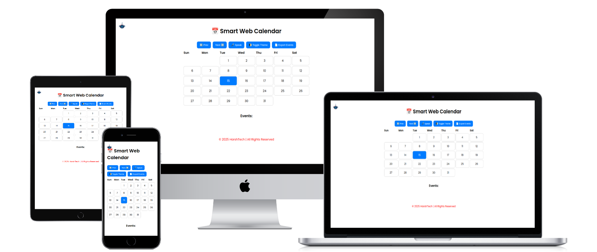

# 🤖 AI Voice Calendar

An advanced, responsive AI-powered calendar web app that allows users to interact using voice commands, add events, navigate months, and export data — all with smart reminders and voice feedback.

---

## 📚 Table of Contents

- [🧠 Features](#-features)
- [🖼️ Screenshots](#-screenshots)
- [🚀 Live Demo](#-live-demo)
- [📂 Project Structure](#-project-structure)
- [🗣️ Voice Commands](#️-voice-commands)
- [⚙️ Built With](#-built-with)
- [🧑‍💻 Author](#-author)
- [📃 License](#-license)

---

## 🧠 Features

- 🎤 Voice assistant with speech recognition & synthesis
- 📆 Interactive monthly calendar view
- ➕ Add events by voice or click
- 🔔 Daily reminder for today’s events
- 🔄 Navigate between months
- 🌓 Light/Dark mode toggle
- 📄 Export event history to PDF
- 💾 Auto-save events via `localStorage`
- 📱 Fully responsive layout for all devices

---

## 🖼️ Screenshots

> 

---

## 🖥️ Live Demo

[](https://harshadteli.github.io/web-calender/)

---


## 📬feedback Form 


[](https://harshadteli.github.io/Feedback-Form-HarshTech/)

---


## 📂 Project Structure

```bash
ai-voice-calendar/
├── index.html        # Main application file
├── /assets/          # Avatar, GIFs, audio (if any)
├── README.md         # Documentation file
 ```

---


🗣️ Voice Commands

Command Example Action

“Add event on 5 July” Adds event to 5th July
“Show today’s events” Speaks all events for today
“Toggle theme” Switches light/dark mode
“Export events” Generates PDF of all events


---

⚙️ Built With

✅ HTML5 / CSS3 / JavaScript

✅ Web Speech API

✅ Speech Synthesis & Recognition

✅ localStorage for persistent data

✅ html2pdf.js for export


---

🧑‍💻 Author

Harshad Teli
Founder of HarshTech Organization

📬 Instagram: @harshadteli_
💼 GitHub: @harshadteli


---

📃 License

This project do not required any License

---

⭐️ If you like this project, please give it a star on GitHub!

---


